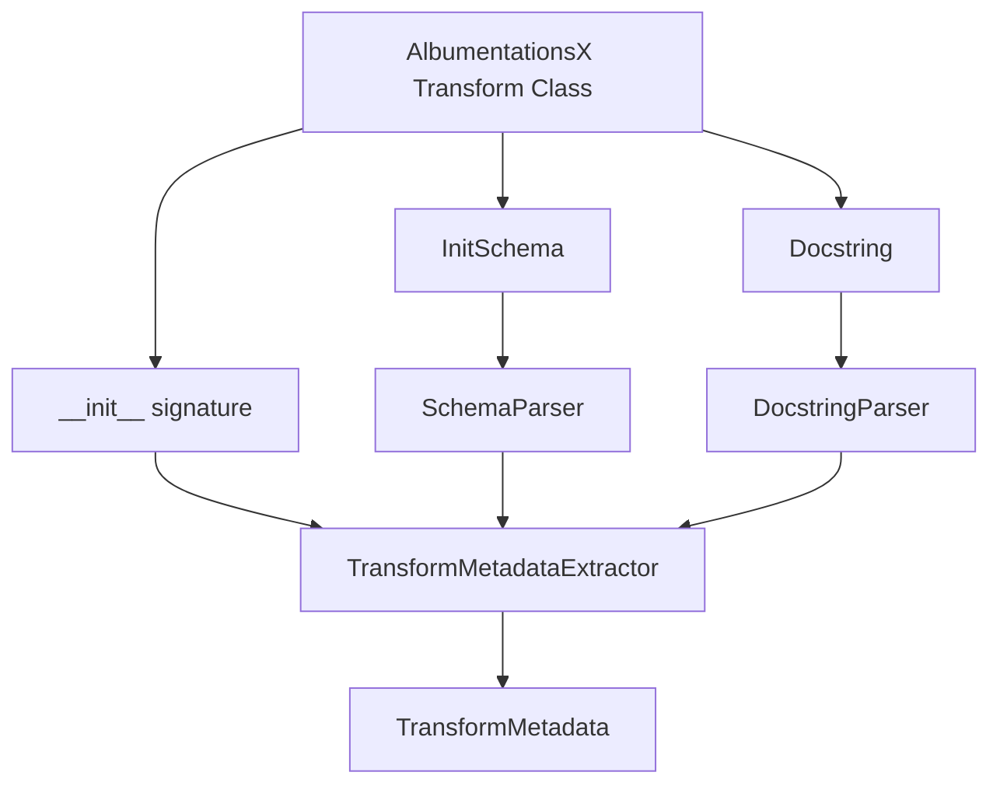

# CLAUDE.md - AI Assistant Guide for albu-spec

## Documentation Rules

**Critical**: Follow these rules for all documentation:

- **No summary docs on every change** - Don't create CHANGES.md, UPDATES.md, or similar for small fixes
- **Root docs only**: `README.md`, `CLAUDE.md`, `CONTRIBUTING.md`, and `CLA.md` live in repo root
- **All other docs**: Go in `docs/` folder
- **Reference or delete**: Every doc in `docs/` must be referenced in CLAUDE.md. If not referenced → delete it
- **Create docs for**: Major features, testing philosophies, usage guides, integration guides
- **Don't create docs for**: Individual bug fixes, minor refactors, trivial changes

## Project Governance

### Licensing
- **Dual License**: AGPL-3.0 (open source) OR Commercial License (proprietary use)
- See **[LICENSE](LICENSE)** for full terms
- Commercial licensing: contact vladimir@albumentations.ai

### Contributing
- All contributors must sign **[CLA](CLA.md)** before first contribution
- Follow **[CONTRIBUTING.md](CONTRIBUTING.md)** for development process
- CLA grants rights for both AGPL and commercial distribution
- Simple signing process via PR comment

### Maintainer
- **Vladimir Iglovikov** (vladimir@albumentations.ai)
- Part of the Albumentations team

## Project Overview

**albu-spec** is a metadata extraction library for **AlbumentationsX** transforms. It programmatically extracts comprehensive metadata from transform classes including:
- Parameter names, types, defaults, and descriptions
- Pydantic constraints (ge, le, gt, lt, validators)
- Transform classification (image_only, dual, transforms_3d)
- Supported targets (image, mask, bboxes, keypoints, etc.)

### Target Library
- **AlbumentationsX**: Next-generation image augmentation library
- **Repository**: https://github.com/albumentations-team/AlbumentationsX
- **Install**: `pip install albumentationsx`
- **Import**: `import albumentations as A` (AlbumentationsX uses the same import name)

### Use Cases
1. Automatic UI generation for transform parameters
2. Validation of transform configurations
3. Documentation generation
4. API schema generation for web services
5. IDE autocomplete and type checking support

## Architecture

### Core Components

```
src/albu_spec/
├── models.py              # Pydantic models (ConstraintInfo, ParameterMetadata, TransformMetadata)
├── schema_parser.py       # Extract constraints from Pydantic InitSchema
├── docstring_parser.py    # Parse Google-style docstrings for descriptions
├── extractor.py           # Main orchestrator combining all extraction methods
└── __init__.py           # Public API (get_transform_metadata, get_all_transforms_metadata)
```

### Data Flow



### Extraction Sources

1. **Pydantic InitSchema** (`transform_class.InitSchema`)
   - Field type annotations
   - Constraints: `Field(ge=0, le=1, validators=[...])`
   - Custom validators with `@field_validator`

2. **`__init__` Signature** (`inspect.signature`)
   - Parameter names
   - Type annotations (including Union, Annotated, Literal)
   - Default values

3. **Docstrings** (Google style)
   - Short description
   - Parameter descriptions from Args section

## Testing Philosophy

### Why We Test Metadata Extraction Consistency

**Core Problem**: AlbumentationsX transforms have THREE sources of truth:
1. Pydantic InitSchema (for validation)
2. `__init__` method signature (for instantiation)
3. Docstrings (for documentation)

These MUST be consistent, but humans make mistakes. Our tests:
- **Detect inconsistencies** automatically
- **Classify root cause**: parser bug vs AlbumentationsX bug
- **Generate actionable reports** for fixing

### Testing Strategy

#### 1. Cross-Method Validation
Compare extracted metadata from different sources:
```python
# These should match:
init_schema_type = metadata_from_initschema(param)
init_signature_type = metadata_from_signature(param)
assert normalize_type(init_schema_type) == normalize_type(init_signature_type)
```

#### 2. Property-Based Testing
Universal invariants that MUST hold for all transforms:
- All InitSchema fields exist in `__init__`
- Constraint ranges are valid (ge ≤ le, gt < lt)
- Default values satisfy their own constraints
- Transform type matches class hierarchy

#### 3. Parametrized Testing
Test multiple transforms with same test logic:
```python
@pytest.mark.parametrize("transform_class", [A.HorizontalFlip, A.Affine, A.ColorJitter])
def test_consistency(transform_class):
    # Single test, multiple transforms
```

### Distinguishing Parser Bugs from AlbumentationsX Bugs

#### Parser Bug Indicators
- **SchemaParser fails to extract valid Field constraints**
- **DocstringParser misparses well-formed docstrings**
- **Type formatter crashes on valid type annotations**
- **Extractor returns incomplete metadata**

→ **Fix in albu-spec**: Improve extraction logic

#### AlbumentationsX Bug Indicators
- **InitSchema type differs from `__init__` type**
  - Example: InitSchema says `int` but `__init__` accepts `int | float`
- **Missing constraints in InitSchema**
  - Example: `__init__` has `ge=0, le=1` but InitSchema doesn't
- **Docstring parameter missing or incorrect**
- **Default value violates constraints**

→ **Report to AlbumentationsX**: File issue with generated report

### xfail Markers

Use pytest xfail to track known issues without blocking CI:

```python
@pytest.mark.xfail(reason="albumentationsx_bug: Affine.scale InitSchema type incomplete")
def test_affine_scale_type():
    # Test will fail but marked as expected
    pass

@pytest.mark.xfail(reason="parser_bug: SchemaParser doesn't handle nested Annotated")
def test_nested_annotated():
    # Parser limitation we plan to fix
    pass
```

**Benefits**:
- CI stays green
- Known issues documented in code
- Easy to track which library needs fixing
- Can auto-generate issue reports

## Development Workflow

### Adding Tests for New Transforms

1. **Add to parametrized fixtures** in `conftest.py`:
```python
@pytest.fixture
def transform_classes():
    return [A.HorizontalFlip, A.Affine, A.ColorJitter, A.NewTransform]
```

2. **Property-based tests automatically cover it**

3. **Add specific tests if needed** in `test_metadata_consistency.py`:
```python
def test_newtransform_special_behavior():
    metadata = get_transform_metadata(A.NewTransform)
    # Transform-specific assertions
```

### Running Tests

```bash
# Run all tests with coverage
pytest

# Run specific test file
pytest tests/test_metadata_consistency.py

# Run tests matching pattern
pytest -k "consistency"

# Run with verbose output
pytest -v

# See xfail reasons
pytest -v --runxfail
```

### Generating Issue Reports

```bash
# Run report generator
pytest tests/test_report_generator.py

# Creates: ALBUMENTATIONSX_ISSUES.md
# Contains all albumentationsx_bug xfail tests formatted for GitHub issues
```

## Code Style and Preferences

### General Principles
- **Be terse**: No verbose explanations, get to the code
- **Be accurate**: Actual working code, not high-level suggestions
- **Treat as expert**: Skip obvious explanations
- **Give code immediately**: Explanation after if needed

### Python Style
- **Type hints**: Use modern syntax (`dict[str, int]` not `Dict[str, int]`)
- **Union types**: Use `|` not `Union` (`int | float` not `Union[int, float]`)
- **Docstrings**: Google style with proper indentation
- **Line length**: 120 chars (configured in pyproject.toml)
- **Imports**: Absolute imports, grouped (stdlib, third-party, local)

### Testing Style
```python
# Good: Parametrized, specific assertion messages
@pytest.mark.parametrize("transform_class,expected_type", [
    (A.HorizontalFlip, "dual"),
    (A.ColorJitter, "image_only"),
])
def test_transform_type(transform_class, expected_type):
    metadata = get_transform_metadata(transform_class)
    assert metadata.transform_type == expected_type, \
        f"{transform_class.__name__} should be {expected_type} but got {metadata.transform_type}"

# Bad: Loop instead of parametrize, unclear failure
def test_transform_types():
    for cls in [A.HorizontalFlip, A.ColorJitter]:
        metadata = get_transform_metadata(cls)
        assert metadata.transform_type  # What should it be?
```

### Assertion Messages
Always include context in assertion messages:
```python
# Good
assert param_name in metadata.parameters, \
    f"Parameter {param_name} missing from {transform_class.__name__} metadata"

# Bad
assert param_name in metadata.parameters
```

## Test Coverage Requirements

### Target Coverage
- **schema_parser.py**: 100% line coverage
- **docstring_parser.py**: 100% line coverage
- **extractor.py**: 95%+ branch coverage
- **models.py**: 100% (Pydantic models, simple)

### Must Test
- ✅ All public API functions
- ✅ All private methods with complex logic
- ✅ Edge cases (None, empty, invalid input)
- ✅ Error paths (exceptions, graceful failures)
- ✅ Type edge cases (Union, Annotated, Literal, nested types)

### Can Skip
- ❌ Simple property getters
- ❌ Pydantic model constructors
- ❌ Obvious pass-through code

## Common Patterns

### Type Normalization
Type hints may differ in formatting but be semantically identical:
```python
def normalize_type(type_str: str) -> set[str]:
    """Normalize type string for comparison."""
    # "int | float | None" vs "float | int | None" should match
    return set(part.strip() for part in type_str.split(" | "))

assert normalize_type(type1) == normalize_type(type2)
```

### Constraint Validation
```python
def validate_constraint_range(constraints: ConstraintInfo) -> None:
    """Verify constraint ranges are logically valid."""
    if constraints.ge is not None and constraints.le is not None:
        assert constraints.ge <= constraints.le, "ge must be <= le"

    if constraints.gt is not None and constraints.lt is not None:
        assert constraints.gt < constraints.lt, "gt must be < lt"

    # ge and gt are mutually exclusive
    assert not (constraints.ge is not None and constraints.gt is not None), \
        "Cannot have both ge and gt"
```

### Snapshot Testing
```python
import json

def test_transform_metadata_snapshot(transform_class, snapshot_dir):
    """Compare extracted metadata with known-good snapshot."""
    metadata = get_transform_metadata(transform_class)

    snapshot_file = snapshot_dir / f"{transform_class.__name__}.json"

    if not snapshot_file.exists():
        # Create initial snapshot
        snapshot_file.write_text(metadata.model_dump_json(indent=2))
        pytest.skip("Created new snapshot")

    expected = json.loads(snapshot_file.read_text())
    actual = metadata.model_dump()

    assert actual == expected, \
        f"Metadata changed for {transform_class.__name__}. " \
        f"Review diff and update snapshot if intentional."
```

## Extending the Library

### Adding New Constraint Types

1. **Update models.py**:
```python
class ConstraintInfo(BaseModel):
    # ... existing fields ...
    new_constraint: float | None = None
```

2. **Update schema_parser.py**:
```python
def _extract_field_constraints(self, field_name: str, field_info: FieldInfo) -> ConstraintInfo | None:
    # ... existing extraction ...
    if hasattr(field_info, "new_constraint") and field_info.new_constraint is not None:
        constraints.new_constraint = field_info.new_constraint
```

3. **Add tests**:
```python
def test_extract_new_constraint():
    # Create mock transform with new constraint
    # Verify extraction
```

### Supporting New Type Annotations

Update `_format_type()` in extractor.py:
```python
def _format_type(self, type_annotation: Any) -> str | list[str]:
    # ... existing type handling ...

    # Handle new type
    if is_new_type(type_annotation):
        return format_new_type(type_annotation)
```

## FAQ

**Q: Why test metadata extraction instead of transform execution?**
A: We're a *metadata extraction* library, not a transform testing library. We ensure metadata is accurate; AlbumentationsX tests ensure transforms work correctly.

**Q: Why property-based tests for all transforms?**
A: Universal invariants (like "all InitSchema params must be in `__init__`") should hold for EVERY transform. Property-based tests scale effortlessly.

**Q: When should I mark a test as xfail?**
A: When you've confirmed the bug exists and classified it (parser vs AlbumentationsX). Don't xfail as a lazy way to ignore failures.

**Q: How do I know if extracted metadata is correct?**
A: Cross-reference multiple sources. If InitSchema, `__init__`, and docstring all agree, it's likely correct. If they disagree, investigate which is authoritative.

**Q: Should tests import `albumentations` or `albumentationsx`?**
A: **`import albumentations as A`** - AlbumentationsX uses the same import name as the original library. Install with `pip install albumentationsx` but import as `albumentations`.

## Additional Documentation

- **[Testing Guide](docs/TESTING.md)** - Detailed testing strategy and examples
- **[Type Comparison Guide](docs/TYPE_COMPARISON.md)** - How to use type comparison for consistency validation
- **[Pre-Commit Hook Guide](docs/PRE_COMMIT_GUIDE.md)** - Creating pre-commit hooks for AlbumentationsX
- **[Contributing Guide](CONTRIBUTING.md)** - How to contribute, development setup, PR process
- **[Contributor License Agreement](CLA.md)** - CLA for dual licensing contributions

## Contributing & Legal

### Contributing to albu-spec

Before contributing, please:
1. Read **[CONTRIBUTING.md](CONTRIBUTING.md)** for development setup and process
2. Sign the **[CLA](CLA.md)** when opening your first PR

### Dual Licensing & CLA

albu-spec uses dual licensing:
- **AGPL-3.0**: For open source projects
- **Commercial License**: For proprietary/commercial use

Contributors must sign the CLA to grant rights for both licenses. The process is simple:
1. Open a pull request
2. CLA bot will check if you've signed
3. Comment: `I have read the CLA Document and I hereby sign the CLA`
4. Bot records signature
5. PR can be merged

This ensures sustainable development while serving both open source and commercial users.

## References

- **AlbumentationsX**: https://github.com/albumentations-team/AlbumentationsX
- **Pydantic**: https://docs.pydantic.dev/
- **pytest**: https://docs.pytest.org/
- **Type hints**: https://docs.python.org/3/library/typing.html

---

*This guide is for AI assistants. Keep it updated as the project evolves.*
